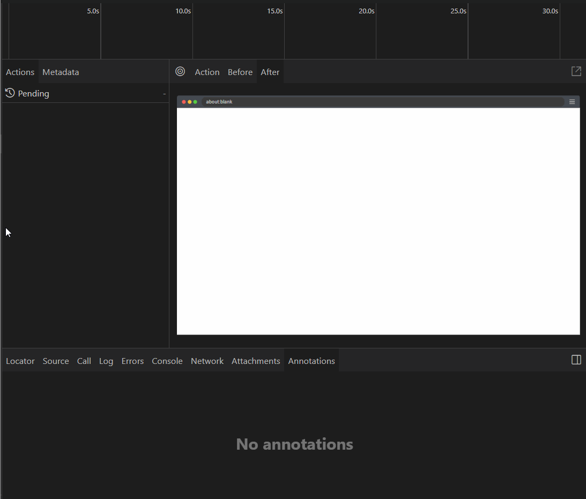

# Playwright MCP Demo — AI-Assisted Browser Tests

# MCP Playwright


## Portfolio
**Playwright MCP Demo** — A minimal portfolio project demonstrating how to generate tests with an MCP-enabled AI agent and run/debug them using Playwright Test UI. In this project, I prompt an MCP-enabled IDE agent to create Playwright tests, then execute and debug them with Playwright Test UI. It includes traces, stable role-based locators, and CI integration. 

Repo: https://github.com/sswampil/mcp-playwright


## What’s inside
- **Playwright core** (`playwright`) — browsers & automation APIs
- **Playwright Test** (`@playwright/test`) — runner, assertions, UI mode, traces
- **Playwright MCP server** (`@playwright/mcp`) — exposes Playwright as a tool to IDE AI clients via the Model Context Protocol (MCP)

## Setup
```bash
npm i
npx playwright install

## Demo



## Why this is cool

- **Agent + Runner:** An MCP-enabled IDE agent generates Playwright tests; I run/debug them with **Playwright Test UI**.
- **Human-in-the-loop:** Prompts live in `/prompts`, generated specs in `/tests`. I review and refine AI output.
- **Real debugging:** Traces, console, network, DOM snapshots make failures explainable.

## Run it yourself

```bash
git clone https://github.com/sswampil/mcp-playwright.git
cd mcp-playwright
npm i
npx playwright install
npm run test:ui

## Reproduce MCP generation
- Install an MCP-enabled IDE client (Continue / Claude Code / Cursor).
- The Playwright MCP server is configured in `.vscode/mcp.json`.
- Open the IDE chat, select the **playwright** tool, and paste:
  - `prompts/ai.smoke.spec.md` → creates `tests/ai.smoke.spec.ts`
  - `prompts/generate-tests.md` → creates `tests/ai.nav.spec.ts`


## 📜 License

This project is licensed under the MIT License — see the [LICENSE](LICENSE) file for details.
